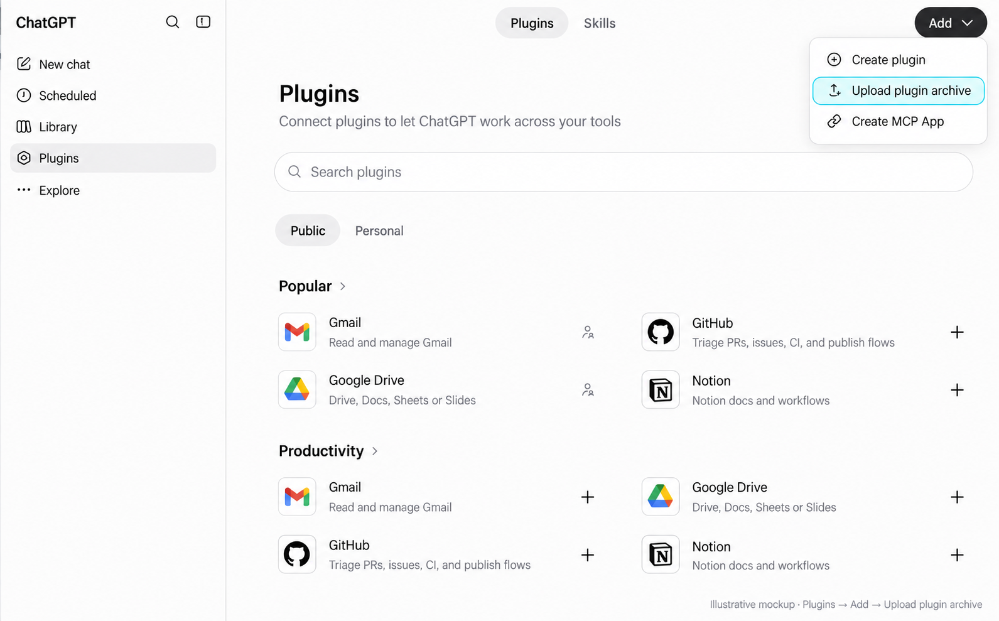

# Boniforce MCP Connector — Public Documentation

> **Hosting target:** publish this page at
> `https://www.boniforce.de/docs/mcp/` (or `https://help.boniforce.de/connector/`)
> before submitting to Anthropic. Anthropic's submission policy requires a
> live public docs URL by the publish date — a GitHub README is accepted
> but a help-center page is preferred and reduces review friction.
>
> Source: this file. Render however your site does markdown (Astro, MkDocs,
> Notion, WordPress page, etc.). Update the version footer when the
> connector ships a new release.

---

## What is the Boniforce connector?

The Boniforce connector is an **MCP server** that brings German credit
checks and sector intelligence directly into ChatGPT, Claude, and any
other MCP-compatible AI assistant. You ask in plain language, the
assistant calls Boniforce on your behalf, and the answer lands in the
chat — no tab-switching, no copy-paste.

It exposes two data surfaces:

1. **Boniforce credit data** — Boniscore, credit-limit recommendation,
   balance-sheet history, per-year financial ratios. Built on
   Bundesanzeiger filings. Per-user authentication via your own
   `sk_live-…` Boniforce API key.

2. **Sectorbench sector intelligence** — current health score, 12-month
   trend, monthly AI-written briefing, and Destatis insolvency series for
   10 German sectors. Operator-funded; no extra credentials needed.

Connector URL: **`https://mcp.boniforce.de/mcp`**

---

## Who can use it?

- **Claude.ai** (Pro, Max, Team, Enterprise) — *Settings → Connectors →
  Add custom connector*.
- **Claude Desktop** (Mac, Windows) — same path.
- **ChatGPT** — Plugins with archive upload; direct MCP connection may require
  Developer mode and workspace permission.
- **Any MCP-compatible client** that supports Streamable HTTP + OAuth 2.1.

Available installation options depend on your account and workspace settings.

---

## Get your Boniforce API key

1. Log into your **Boniforce dashboard** at
   [boniforce.de](https://www.boniforce.de).
2. Open **API-Schlüssel** in the sidebar.
3. Click **"Neuen Schlüssel erstellen"**, name it (e.g. `claude` or
   `chatgpt`), confirm.
4. Copy the key **immediately** — it starts with `sk_live-…` and is shown
   only once.

Treat the key like a password. Revoke or rotate it any time from the same
page; revocation disconnects the connector instantly.

If you do not have a Boniforce account, contact your Boniforce account
manager or sign up at [boniforce.de](https://www.boniforce.de).

---

## Add to Claude

1. **Settings → Connectors → Add custom connector**.
2. Paste `https://mcp.boniforce.de/mcp` and save.
3. Claude opens a browser tab on `mcp.boniforce.de/oauth/login`.
4. Paste your Boniforce API key. Done — the tools appear in your sidebar.

The key is validated against `api.boniforce.de` on submission, encrypted
at rest, and bound to your Claude account via OAuth.

## Add to ChatGPT with a plugin

1. [Download Boniforce plugin v0.4.0 (ZIP)](https://github.com/Boniforce/boniforce-mcp/raw/refs/heads/main/releases/boniforce-credit-check-plugin-0.4.0.zip) without extracting it.
2. In ChatGPT, open **Plugins → Add → Upload plugin archive**.
3. Select the ZIP and complete the installation prompts.
4. Use **Connect** / **Sign in** if offered. Enter your Boniforce API key only
   on the authorization page at `https://mcp.boniforce.de`.
5. Start a new chat, select or mention Boniforce, and ask for your existing
   reports first. No new paid report is needed to test the connection.

*Illustrative mockup with private projects and recent chats removed.*

If the plugin is installed but its tools are unavailable, use
**Plugins → Add → Create MCP App**, enter `https://mcp.boniforce.de/mcp`, and
choose **OAuth**. Complete authorization and enable the connection in your
chat. Developer mode may be required for this direct connection; availability
depends on your account and workspace settings.

See the [complete plugin tutorial](CHATGPT_PLUGIN_INSTALL.md) for setup,
updates, credit costs, and troubleshooting. The Custom GPT builder and
OpenAPI import are not part of this installation. A personal ZIP installation
does not imply an approved listing in OpenAI's public directory.

Compatible clients show a live card during report creation. Other clients
use the same tools with text results. New reports usually take 30–120 seconds.

---

## What you can ask

| Plain-English ask                                            | Under the hood |
|--------------------------------------------------------------|----------------|
| *"Find Müller GmbH on Boniforce."*                           | `search_companies` |
| *"Boniscore für HRB 12345 in München."*                      | `create_report` → `get_job_status` (poll) → `get_report` |
| *"Show me the balance-sheet history."*                       | `get_report_financial_data` |
| *"Eigenkapitalquote-Trend der letzten 3 Jahre?"*             | `get_report_financial_analysis` |
| *"Welche Berichte habe ich diese Woche erstellt?"*           | `list_reports` |
| *"Wie ist die Lage in der Bauwirtschaft?"*                   | `get_branch` |
| *"Monatliches Briefing für die Automobilindustrie."*         | `get_branch_news` |
| *"12 Monate Insolvenzen Einzelhandel."*                      | `get_branch_insolvency_history` |
| *"Ranke alle 10 deutschen Branchen nach Score."*             | `get_branch_ranking` |

The model picks the right tool sequence on its own — describe what you
want in German or English.

---

## Tool catalogue

### Boniforce credit-data tools (per-user `sk_live-…` key)

| Tool | What it does |
|------|--------------|
| `search_companies` | Find a German company by name → register info |
| `search_companies_advanced` | Broader fallback search → `search_result_id` + city |
| `list_reports` | Reports you have already generated |
| `create_report` | Start a Boniscore report (write tool — initiates Bundesanzeiger fetch) |
| `get_report` | Boniscore, credit limit, APPROVE / REVIEW / DECLINE verdict |
| `get_job_status` | Poll a long-running report job (about 120 s typical) |
| `get_financial_data` | Direct financial statements (25 credits) |
| `get_financial_analysis` | Direct financial score + ratios (50 credits) |
| `get_report_financial_data` | Per-year balance-sheet data |
| `get_report_financial_analysis` | Per-year financial ratios + sub-scores |
| `get_company_details` | Address, firmographics, and representatives |
| `get_company_shareholders` | Shareholders (free cached; 25 credits on refresh) |
| `get_company_holdings` | Company holdings (free cached; 25 credits on refresh) |

### Sectorbench sector-intelligence tools (no extra credentials)

| Tool | What it does |
|------|--------------|
| `list_branch_scores` | Snapshot of all 10 sectors |
| `get_branch_ranking` | League table with monthly delta |
| `get_branch` | One sector — composite score + risk level |
| `get_branch_history` | Monthly score history (1–24 months) |
| `get_branch_news` | Current month's AI briefing (drivers, risks, outlook) |
| `get_branch_insolvency_history` | Destatis insolvency series (1–36 months) |
| `get_branch_indicator_history` | One indicator (ifo, PMI, ZEW…) over time |
| `list_branch_indicators` | Catalogue of available indicators |
| `get_sectorbench_meta` | Data freshness (last refresh, coverage) |

Sector keys: `automotive`, `healthcare`, `construction`,
`renewable_energy`, `logistics`, `fintech`, `it_services`, `retail`,
`hospitality`, `manufacturing`.

---

## How long does a credit check take?

A new Boniscore report typically completes in **about 120 seconds** — the
system pulls and analyses the latest Bundesanzeiger annual filing on demand.
The plugin follows the existing job and reports a delay if processing takes
longer than usual; it should not create a duplicate paid report. For follow-up questions on the same
company within the same session, the report is reused (no second fetch).

---

## FAQ

**Do I need a separate password?**
No. Your Boniforce API key is the only credential. It is validated
against your Boniforce account when you paste it.

**Will my chat history be sent to Boniforce?**
No. The connector forwards only the structured arguments the model needs
(company name, register number, sector key). Your conversation stays
between you and your AI provider.

**How is my API key stored?**
Encrypted at rest with Fernet (AES-128-CBC + HMAC-SHA-256). The
encryption key sits in a server-side environment variable that is never
logged or echoed. We never see your Boniforce account password.

**Can I revoke access?**
Yes. Revoke or rotate the key in your Boniforce dashboard — the
connector stops working on the next call until you paste a new one.

**Can my team share one connector?**
Yes. Each teammate adds the same URL (`https://mcp.boniforce.de/mcp`)
and pastes their own Boniforce API key. Sessions are isolated by key
identity (`sha256(api_key)`).

**What sectors are covered by Sectorbench?**
The 10 listed above. Data sources include Destatis (insolvencies), ifo,
S&P Global PMI, Eurostat, and Bundesbank.

**Does it work on free Claude / free ChatGPT plans?**
Plugin and connector availability depends on the account and workspace settings.
Check the installation options exposed by your client.

**What if the report does not finish?**
After 120 seconds the assistant reports that finalisation is taking longer
than usual and may keep checking through 180 seconds. If the report is still
delayed, retrying usually succeeds; if it persists, contact Boniforce support.

---

## Troubleshooting

| Symptom | Likely cause | Fix |
|---------|-------------|-----|
| 401 in the chat | API key revoked or rotated | Paste a fresh key |
| "No annual filings indexed" on financial drill-down | Company has no Bundesanzeiger filing yet | The Boniscore from `get_report` is still valid |
| Sector data returns 503 | Operator token unavailable | Server-side issue — please contact support |
| Tools missing from the sidebar | Connector cached an old tool list | Disconnect and reconnect in your client |

---

## Privacy and security

- OAuth 2.1 with PKCE, mandatory `S256` (no `plain`).
- Per-user JWT, 1 h TTL, audience-bound to `mcp.boniforce.de/mcp`.
- API keys stored Fernet-encrypted; user identity is `sha256(api_key)`.
- TLS terminated at Caddy + Let's Encrypt.
- Origin allowlist on `/mcp`: `claude.ai`, `chatgpt.com`, issuer.

Full privacy policy:
[boniforce.de/datenschutzerklaerung-2/](https://www.boniforce.de/datenschutzerklaerung-2/).

---

## For developers

Source code, self-hosting, OAuth internals, and Custom GPT Actions
recipes live in the GitHub repository:
[github.com/Boniforce/boniforce-mcp](https://github.com/Boniforce/boniforce-mcp).

---

*Last updated: 2026-08-14. Connector version: 0.6.0. Custom GPT Actions schema: 1.1.0.*
